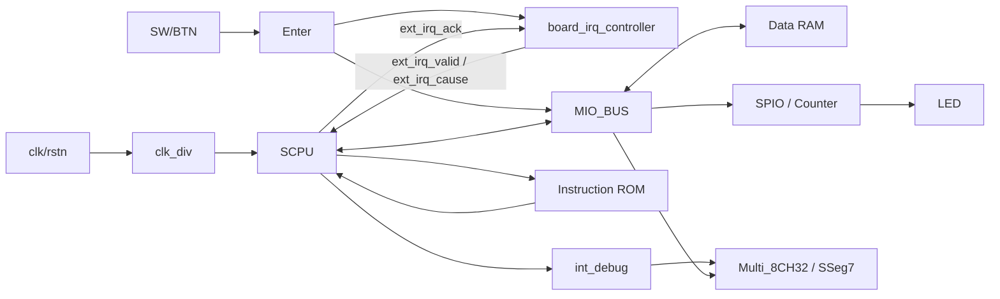
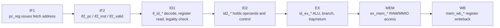
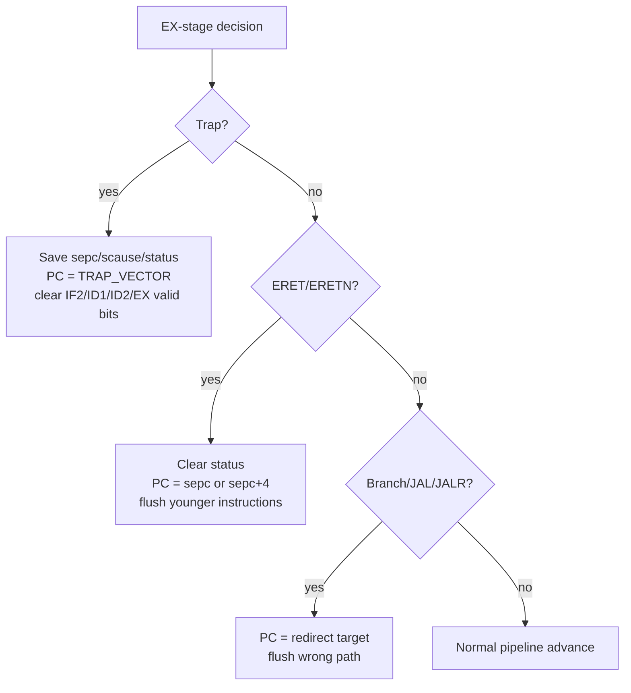
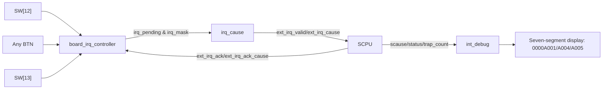

# RISC-V Seven-Stage Pipeline on Nexys A7

This project implements a teaching-oriented RV32 RISC-V pipeline CPU on the Digilent Nexys A7 FPGA board. The top-level design is `top.v`, the CPU core is `SCPU.v`, and the system connects instruction ROM, data RAM, GPIO, seven-segment display logic, counters, and a board-level interrupt controller.

**Maximum main/CPU clock frequency: 150 MHz.**

## Hardware Platform

| Item | Description |
|---|---|
| Board | Digilent Nexys A7 |
| FPGA | Xilinx Artix-7 family, depending on the Nexys A7 50T/100T board variant |
| Main clock | Board clock input, divided/managed by `clk_div` for the CPU clock |
| Maximum frequency | 150 MHz main/CPU clock |
| Inputs | `SW[15:0]`, `BTN[4:0]`, synchronized by the `Enter` module |
| Outputs | `LED[15:0]`, 8-digit seven-segment display |
| Memory | Instruction ROM `rom`, data RAM `ram` |
| Peripherals | `SPIO`, `Counter_x`, `MIO_BUS`, `board_irq_controller` |

## Top-Level Architecture



Key files:

| File | Role |
|---|---|
| `top.v` | Nexys A7 top-level integration |
| `SCPU.v` | Seven-stage RISC-V pipeline CPU |
| `ctrl.v`, `EXT.v`, `ALU.v`, `branch.v`, `RF.v` | Decode, immediate generation, execution, branch compare, and register file |
| `MIO_BUS.V` | RAM/MMIO address selection |
| `board_irq_controller.v` | Board interrupt pending/mask/ack/priority logic |
| `tb_*.sv` | Core, top-level, and interrupt regression testbenches |

## Seven-Stage Pipeline

`SCPU.v` is organized around seven pipeline stages. The pipeline register names directly describe the stage boundaries.



| Stage | Main Work | Key Signals |
|---|---|---|
| IF1 | Generate fetch address | `pc_reg`, `PC_out` |
| IF2 | Buffer fetched instruction | `if2_pc`, `if2_inst`, `if2_valid` |
| ID1 | Decode, immediate extension, legality check, register read | `if_id_*`, `id_trap_cause` |
| ID2 | Hold decoded operands/control and late forwarding inputs | `id2_*`, `id2_redirect_taken` |
| EX | ALU, branch compare, jump target, trap/return decision | `id_ex_*`, `ex_scause`, `ex_trap_taken` |
| MEM | Load/store through RAM or MMIO | `ex_mem_*`, `mem_wait_pending` |
| WB | Write ALU/load/PC+4 result back to register file | `mem_wb_*`, `wb_data`, `wb_regwrite` |

## Control Flow and Hazards

The core handles load-use hazards with stalls and uses forwarding paths from later stages. Branches, jumps, traps, and returns all invalidate younger wrong-path pipeline entries.



Typical control priority:

```text
trap / return / redirect
> memory wait
> load-use stall
> normal pipeline advance
```

## Interrupts and Exceptions

The CPU uses a compact custom trap mechanism rather than the full RISC-V privileged CSR set.

| Register/Signal | Purpose |
|---|---|
| `sepc` | Saves the EX-stage PC when a trap is accepted |
| `scause` | Saves the trap cause |
| `status[0]` | Marks whether the CPU is currently inside trap handling |
| `intmask` | Cause-level mask, default `8'h1f` |
| `trap_count` | Debug counter for accepted traps |

Cause encoding:

| Cause | Meaning |
|---|---|
| `8'h01` | Timer |
| `8'h02` | Illegal instruction |
| `8'h03` | Syscall / `ecall` |
| `8'h04` | Button interrupt |
| `8'h05` | Switch interrupt |

Board-level interrupt path:



Board interrupt priority:

```text
SW[12] timer > button > SW[13] switch
```

CPU trap-cause priority:

```text
current EX-stage exception / ecall
> legacy INT timer pending
> external interrupt pending
> CAUSE_NONE
```

In the current `top.v`, the legacy `INT` port is tied to `1'b0`. Board interrupt demos use the `ext_irq_valid/ext_irq_cause` path.

## MMIO Map

`MIO_BUS.V` selects data RAM or peripherals based on the CPU address.

| Address | Access | Meaning |
|---|---|---|
| `0x0000_0000` base | R/W | Data RAM |
| `0xE000_0000` | R/W | GPIO/LED-related channel |
| `0xF000_0000` base | R/W | Counter, switches, buttons, and board peripherals |
| `0xF000_0010` | R | `IRQ_PENDING` |
| `0xF000_0014` | R/W | `IRQ_MASK` |
| `0xF000_0018` | W | `IRQ_ACK`, write 1 to clear pending bits |
| `0xF000_001C` | R | Highest-priority `IRQ_CAUSE` |

## Debug Display

| Operation | Display Behavior |
|---|---|
| `SW[10]=1` | LEDs show raw switch state |
| `SW[11]=1` | LEDs show button state |
| Toggle `SW[12]` | Seven-segment display latches `0000A001` |
| Press any button | Seven-segment display latches `0000A004` |
| Toggle `SW[13]` | Seven-segment display latches `0000A005` |

## Regression Scripts

```powershell
.\run_scpu_tb.ps1
.\run_irq_regression.ps1
.\run_vivado_regression.ps1
.\run_vivado_bitstream.ps1
```

`run_irq_regression.ps1` covers the core interrupt paths, board IRQ controller, and top-level interrupt loop. Typical checked paths include:

```text
timer interrupt
illegal instruction exception
syscall/ecall exception
external interrupt
SW[12] / button / SW[13] top-level loop
```

## Current Scope

- This is a teaching/experimental RV32 pipeline CPU, not a complete RISC-V privileged architecture implementation.
- Trap handling uses custom `sepc/scause/status/intmask` registers.
- Standard privileged CSRs such as `mstatus`, `mie`, `mip`, `mtvec`, `mepc`, and `mcause` are not implemented.
- The current top level directly connects ROM, RAM, and MMIO. If I-Cache or D-Cache modules are added later, this README and the regression tests should be updated together.
